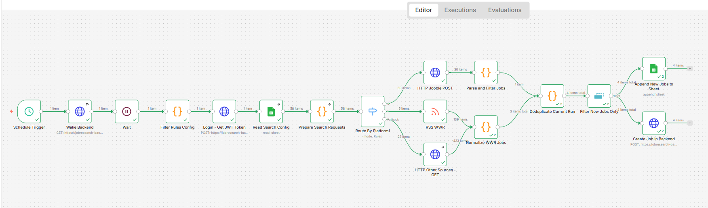

# n8n Job Search Automation Workflow

## Overview

**n8n Job Search Automation Workflow**  is an automated workflow built with n8n to collect job posts from multiple public job sources, including Jooble, We Work Remotely (RSS), RemoteOK, Remotive, and Himalayas. RemoteOK, Remotive, and Himalayas share one request branch, while Jooble and We Work Remotely each use their own.

The workflow runs on a scheduled trigger. It first wakes up the backend and logs in, then prepares search requests and handles different request methods for each source. Job listings are then parsed and filtered, duplicates are removed based on existing records, and new matching jobs are appended to both Google Sheets and the backend.

This project demonstrates a practical automation pipeline for job data collection, filtering, deduplication, and structured storage.

## Workflow Overview



## Configuration Example
| keyword | location | work_type | platform | active |
|---|---|---|---|---|
| Frontend Developer | Madrid | hybrid | jooble | TRUE |
| React Developer | Spain | remote | jooble | TRUE |
| Software Engineer | worldwide | remote | remoteok | TRUE |
| Technical Support Engineer | Europe | remote | remotive | TRUE |
| frontend | Europe | remote | wwr | TRUE |


## Output Example

| job_id | title | company | location | work_type | platform | status | salary | url |
|---|---|---|---|---|---|---|---|---|
| jooble_507219307 | Software Engineer | CloudWorks | Europe | Hybrid | jooble | INTERESTED | | https://jooble.org/desc/... |
| wwr_community-sports-partners-web-developer | Web Developer | Community Sports Partners | worldwide | Remote | wwr | INTERESTED | | https://weworkremotely.com/remote-jobs/... |
| remoteok_1134087 | Frontend Developer | DemoTech | worldwide | Remote | remoteok | INTERESTED | | https://remoteok.com/remote-jobs/... |


## Features

- **Scheduled automation** – Runs automatically on a configurable schedule.
- **Cold-start resilience** —  If the backend is asleep (common on free-tier hosting), a health-check ping with retries wakes it up first, then a short wait gives it time to fully start before login is attempted.
- **Config-driven search setup** – Search keywords, locations, target platforms, and active/inactive status are managed entirely from a Google Sheet, requiring no code changes to add or disable a search.
- **Multi-source ingestion via dynamic routing** – A single platform-based Switch node routes each search request to its target source based on the `platform` field.
- **Centralized keyword rules** — Target-role keywords and excluded keywords are defined once in a shared configuration node and referenced by every parsing branch.
- **Job parsing and normalization** – Each source's raw response format is parsed into a common schema (title, company, location, work mode, salary, posted date, external job ID, etc.).
- **Two-layer duplicate prevention** — Results are deduplicated within the current run, then checked against previously processed job IDs before anything is written downstream.
- **Dual structured output** — Filtered, deduplicated job listings are written to both a Google Sheet (for quick manual review) and a backend REST API (the application's database of record).

## Workflow Architecture

```txt
Schedule Trigger
        ↓
Wake Backend (GET /health, with retry on fail)
        ↓
Wait (fixed buffer, covers remaining cold-start time)
        ↓
Filter Rules Config (shared keyword rules, referenced downstream)
        ↓
Login - Get JWT Token
        ↓
Read Search Config (Google Sheets)
        ↓
Prepare Search Requests
        ↓
Route By Source Type (Switch, branches on the `platform` field)
        ├── Jooble        → HTTP Jooble POST
        ├── WeWorkRemotely → RSS WWR
        └── Other sources  → HTTP Other Sources - GET
                ↓
        Parse and Filter Jobs   (Jooble + Other sources branches)
        Normalize WWR Jobs      (WeWorkRemotely branch)
                ↓
        Deduplicate Current Run
                ↓
        Filter New Jobs Only
                ├── Append New Jobs to Sheet
                └── Create Job in Backend
```

The number of items processed at each step varies depending on the search configuration, each source's API/RSS response, the shared keyword rules, and which job IDs already exist in the backend and the Google Sheet.

## Node Reference

| Node | Type | Description |
|---|---|---|
| Schedule Trigger | Trigger | Starts the workflow on a configurable schedule. |
| Wake Backend | HTTP Request | Pings the backend's `/health` endpoint with retry-on-fail enabled, to wake a sleeping free-tier instance before authentication is attempted. |
| Wait | Wait | Adds a fixed delay after the wake-up ping, as additional buffer for slower cold starts. |
| Filter Rules Config | Code | Returns the shared target-keyword and excluded-keyword rules used by all downstream parsing nodes. |
| Login - Get JWT Token | HTTP Request | Authenticates against the backend and retrieves a JWT used by subsequent backend calls. |
| Read Search Config | Google Sheets | Loads search keywords, locations, target platforms, and active status from the configuration sheet. |
| Prepare Search Requests | Code | Transforms configuration rows into structured request parameters. |
| Route By Source Type | Switch | Routes each request to its target source branch based on the platform field. |
| HTTP Jooble POST | HTTP Request | Fetches job listings from Jooble via POST. |
| RSS WWR | RSS Feed Read | Fetches job listings from WeWorkRemotely's RSS feed. |
| HTTP Other Sources - GET | HTTP Request | Fetches job listings from RemoteOK, Remotive, and Himalayas via GET. |
| Parse and Filter Jobs | Code | Parses Jooble's raw response, applies the shared filtering rules, normalizes fields, and generates a stable deduplication ID. |
| Normalize WWR Jobs | Code | Parses WeWorkRemotely's RSS response, applies the shared keyword rules, normalizes fields, and generates a stable deduplication ID. |
| Deduplicate Current Run | Code | Removes duplicate job IDs produced within the same execution. |
| Filter New Jobs Only | Remove Duplicates / Deduplication | Keeps only job listings not already processed in a previous run. |
| Append New Jobs to Sheet | Google Sheets | Appends new filtered job listings to the Google Sheets review log. |
| Create Job in Backend | HTTP Request | Creates a new job record via the backend's `POST /api/jobs` endpoint, including source-tracking fields. |


## Getting Started

### Prerequisites

* n8n, either self-hosted or n8n Cloud
* Google account with Google Sheets access
* Jooble API key, if Jooble is enabled as a source
* Access to the public job sources used in the workflow, such as RemoteOK and Remotive

### Setup

1. Create or import the workflow in n8n.
2. Create a Google Sheets configuration table with the required columns (see Configuration Reference below).
3. Configure Google Sheets credentials in n8n.
4. Add the Jooble API key in the relevant HTTP request node, if Jooble is enabled.
5. Replace the Google Sheet URLs/IDs and the backend URL in the workflow nodes with your own.
6. Confirm the `Wake Backend` node's URL points at your backend's health-check endpoint, and that Retry On Fail is enabled.
7. Run the workflow manually to test the output, including a test run after the backend has been idle, to confirm the cold-start handling works.
8. Activate the workflow schedule only after confirming the filtered results and both write destinations are correct.
   
## Configuration Reference

| Field | Description | Example |
|---|---|---|
| `keyword` | Job search keyword used to build the request. | `frontend developer` |
| `location` | Target location or remote search area. | `remote`, `Spain` |
| `work_type` | Expected work mode for the search (informational; the actual mode on each result is normalized downstream). | `remote`, `hybrid` |
| `platform` | Job source identifier used by the Switch node to route the request. | `jooble`, `wwr`, `remoteok`, `remotive`, `himalayas` |
| `active` | Enables or disables a search row. | `true`, `false` |


## Notes on Item Counts

The number of items shown in n8n may vary between executions. This depends on the search configuration, responses from each job source, the shared filtering rules, the two-layer deduplication checks, and existing records in both the backend database and the Google Sheet.

For this reason, this documentation focuses on the automation process and architecture rather than fixed item counts.

## Tech Stack

- **Automation platform**: n8n
- **Job sources**: Jooble API, RemoteOK API, Remotive API, WeWorkRemotely (RSS), Himalayas
- **Data processing**: JavaScript Code nodes in n8n, with a centralized rules configuration node shared across parsing branches
- **Storage and configuration**: Google Sheets (search configuration and review log)
- **System of record**: Spring Boot REST API (JWT-authenticated), PostgreSQL on Supabase
- **Resilience**: backend health-check polling with retry-on-fail, to tolerate cold starts on free-tier hosting
  
## License

No license specified.

